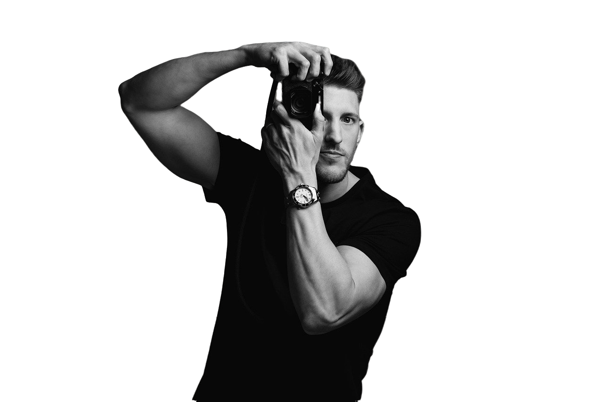

# Portfólio Fotográfico 

## 📌 Visão Geral

Portfólio profissional para o fotógrafo, destacando seus trabalhos em casamentos, eventos, moda e retratos. O projeto combina design minimalista com interações modernas, incluindo um menu fullscreen, carrossel de imagens e tema escuro/claro.

## ✨ Funcionalidades

- **Design Responsivo**: Adaptável a todos os dispositivos (mobile, tablet, desktop).
- **Tema Escuro/Claro**: Alternância com persistência via `localStorage`.
- **Menu Fullscreen**: Animação suave com divisão de conteúdo.
- **Carrossel (Swiper)**: Galeria de projetos e imagens do Instagram.
- **Efeitos de Hover**: Interações visuais em cards e links.
- **Loading Screen**: Tela de carregamento personalizada.
- **Formulário de Contato**: Integração simples para captação de leads.

## 🛠️ Tecnologias

- **Frontend**: HTML5, CSS3 (Flexbox, Grid, Animations), JavaScript (ES6+).
- **Bibliotecas**: 
  - [Swiper.js](https://swiperjs.com/) (carrossel)
  - [Remix Icon](https://remixicon.com/) (ícones)
- **Ferramentas**: CSS Variables, Media Queries, Scroll Behavior.

## 🎨 Design

- **Cores Principais**: 
  - `#1e1e1e` (fundo escuro)
  - `#eb5939` (destaque laranja)
  - `#b7ab98` (texto claro)
- **Tipografia**: 
  - `Poppins` (corpo de texto)
  - `Playfair Display` (títulos)

